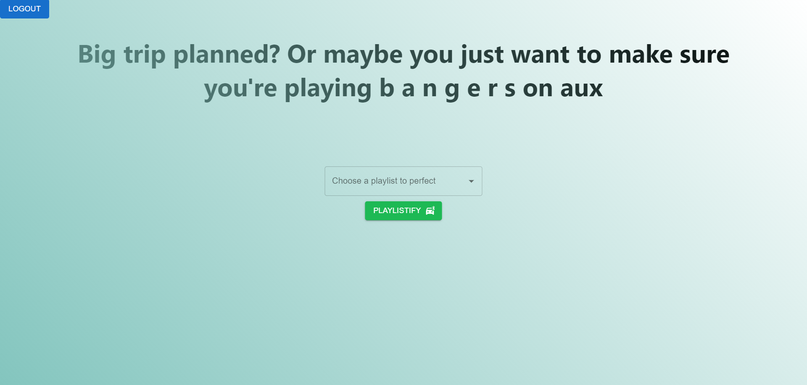
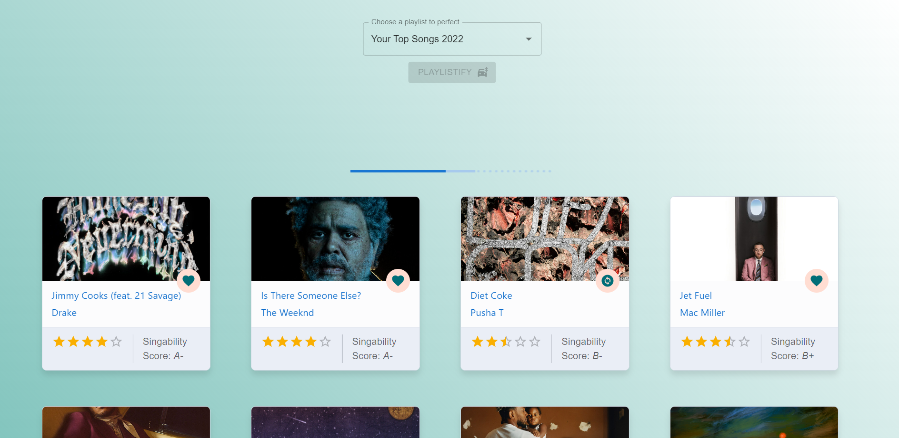

# 🎵 Playlistify! 🎵

A React web app that calculates the "singability" of your playlist tracks and rates them on a 5-star basis.




## Installation

1. If this is your first time cloning a repository, follow [this](https://docs.github.com/en/repositories/creating-and-managing-repositories/cloning-a-repository)
2. Once you've cloned the repo, navigate to the root of the repository
4. In your terminal, run `npm install`
5. Create or navigate to a .env file and input your Spotify App details as seen below

```
# file: .env
REACT_APP_SPOTIFY_CLIENT_ID=<client-id>
REACT_APP_SPOTIFY_REDIRECT_URI=http://localhost:3000 (or another port)
REACT_APP_SPOTIFY_AUTH_ENDPOINT=https://accounts.spotify.com/authorize?
```

6. Run `npm start` in your terminal and navigate to http://localhost:3000 or the local port that you set in your `.env` file
